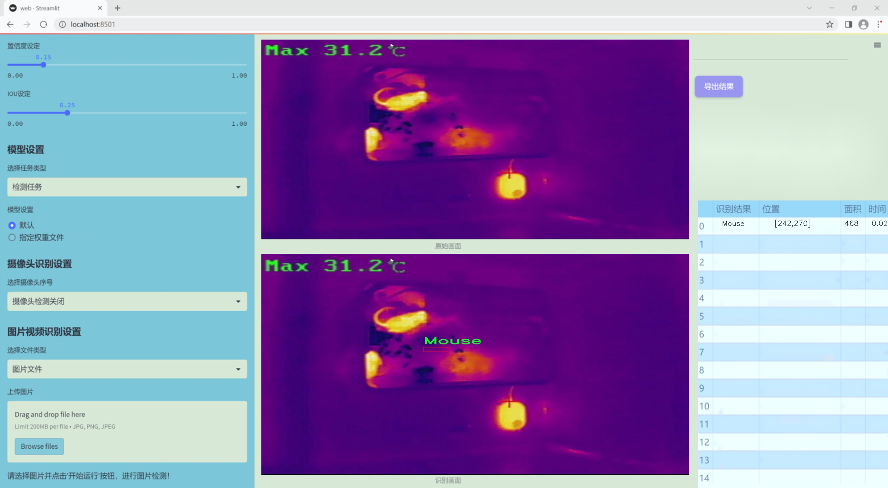
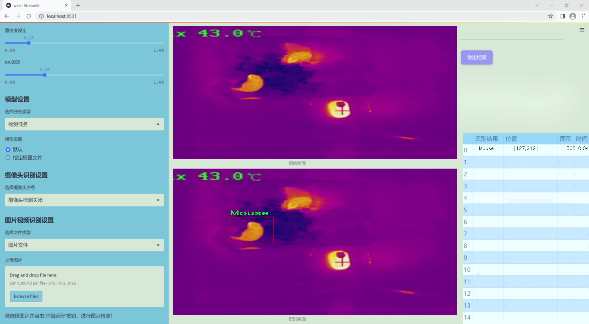
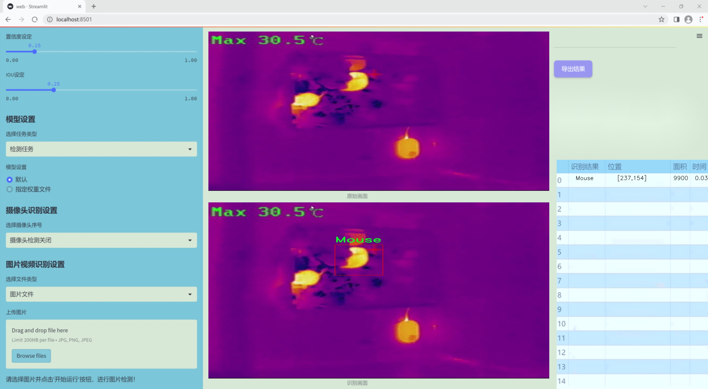
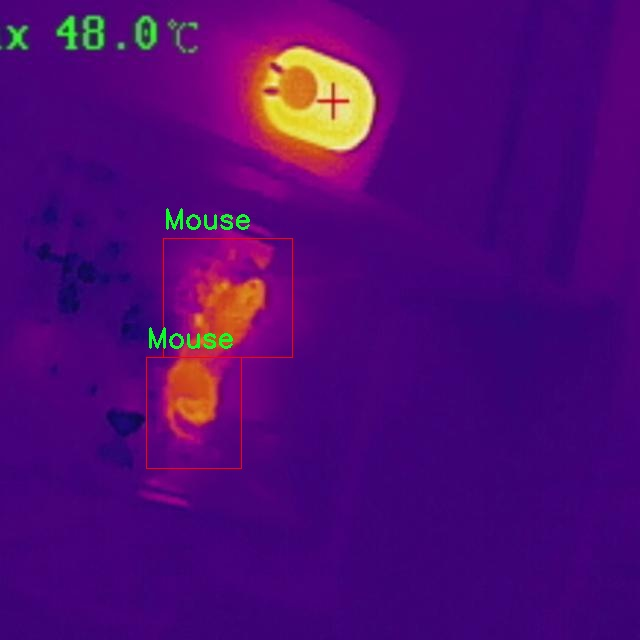
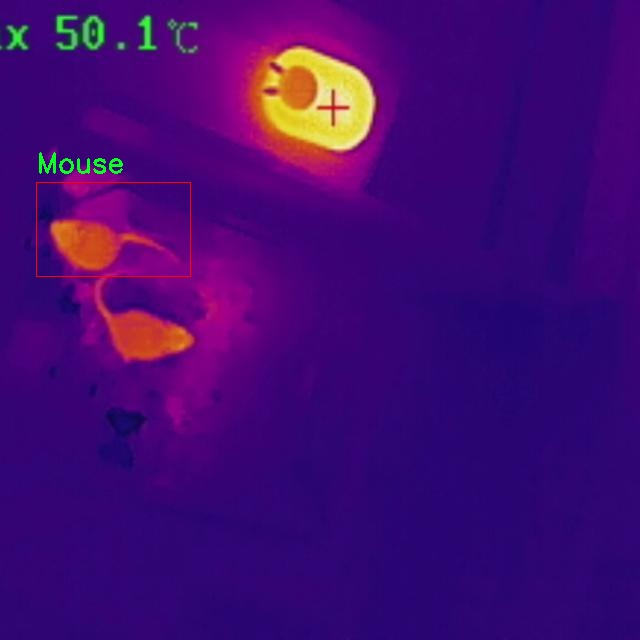
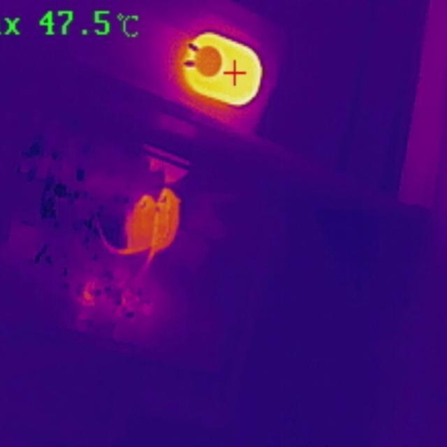
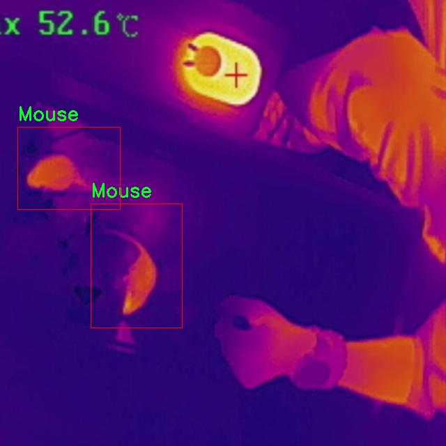
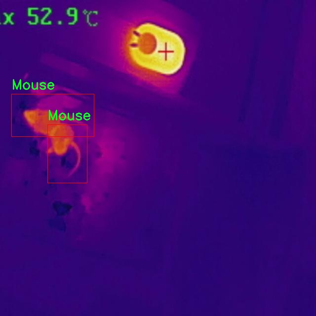

### 1.背景意义

研究背景与意义

随着科技的迅猛发展，计算机视觉技术在各个领域的应用日益广泛，尤其是在生物医学、安防监控和智能交通等领域。红外光谱技术作为一种非接触式的检测手段，能够有效捕捉物体的热辐射信息，具有高灵敏度和高精度的特点。在动物行为研究和生态监测中，红外光谱技术的应用逐渐成为一种重要的研究工具。尤其是在小型动物（如老鼠）的监测中，传统的监测方法往往受到环境因素的限制，而红外光谱技术能够在各种光照条件下进行有效检测，从而提高监测的可靠性和准确性。

本研究旨在基于改进的YOLOv11模型，构建一个高效的红外光谱老鼠检测系统。YOLO（You Only Look Once）系列模型因其实时性和高准确率而受到广泛关注，然而，随着数据集的不断丰富和应用场景的多样化，现有模型在特定任务中的表现仍有提升空间。通过对YOLOv11模型的改进，结合特定的红外光谱数据集，我们希望能够提高老鼠检测的精度和速度，从而为生态监测和生物研究提供更为有效的技术支持。

本研究所使用的数据集包含四个类别（人类、光源、老鼠和背景），其中老鼠的检测是我们关注的重点。数据集中的133幅图像为模型的训练和验证提供了基础，而在此基础上，我们将通过优化模型架构和训练策略，探索在红外光谱条件下对老鼠的高效检测方法。通过本研究，我们期望不仅能推动计算机视觉技术在生物监测领域的应用，还能为相关领域的研究提供新的思路和方法，具有重要的理论意义和实际应用价值。

### 2.视频效果

[2.1 视频效果](https://www.bilibili.com/video/BV1ooBYY4EkE/)

### 3.图片效果







##### [项目涉及的源码数据来源链接](https://kdocs.cn/l/cszuIiCKVNis)**

注意：本项目提供训练的数据集和训练教程,由于版本持续更新,暂不提供权重文件（best.pt）,请按照6.训练教程进行训练后实现上图演示的效果。

### 4.数据集信息

##### 4.1 本项目数据集类别数＆类别名

nc: 4
names: ['0', 'Human', 'Light', 'Mouse']


该项目为【目标检测】数据集，请在【训练教程和Web端加载模型教程（第三步）】这一步的时候按照【目标检测】部分的教程来训练

##### 4.2 本项目数据集信息介绍

本项目数据集信息介绍

本项目旨在改进YOLOv11模型，以实现高效的红外光谱老鼠检测系统。为此，我们构建了一个专门的数据集，涵盖了与老鼠检测相关的多种类别。该数据集共包含四个类别，分别为“0”（背景）、“Human”（人类）、“Light”（光源）和“Mouse”（老鼠）。这些类别的设计旨在提供一个多样化的环境，以便模型能够在不同的场景中有效识别和区分目标对象。

在数据集的构建过程中，我们收集了大量的红外光谱图像，确保涵盖各种环境条件和光照变化。这些图像不仅包括老鼠的不同姿态和活动状态，还包括人类和光源的干扰，以模拟真实世界中的复杂情况。通过这种方式，我们的数据集能够帮助模型学习到更为丰富的特征，从而提高其在实际应用中的鲁棒性和准确性。

此外，为了增强数据集的多样性，我们采用了数据增强技术，包括旋转、缩放、翻转等方法，以生成更多的训练样本。这些增强样本有助于提高模型的泛化能力，使其在面对未见过的图像时依然能够保持较高的检测精度。

在标注方面，我们采用了严格的标注流程，确保每一张图像中的目标对象都得到了准确的标记。标注的准确性直接影响到模型的训练效果，因此我们在标注过程中进行了多次审核和校正，以确保数据集的高质量。

综上所述，本项目的数据集不仅具备丰富的类别信息和多样的图像样本，还经过精心的标注和增强处理，旨在为改进YOLOv11模型提供坚实的基础，助力于实现更为精准的红外光谱老鼠检测。











### 5.全套项目环境部署视频教程（零基础手把手教学）

[5.1 所需软件PyCharm和Anaconda安装教程（第一步）](https://www.bilibili.com/video/BV1BoC1YCEKi/?spm_id_from=333.999.0.0&vd_source=bc9aec86d164b67a7004b996143742dc)


[5.2 安装Python虚拟环境创建和依赖库安装视频教程（第二步）](https://www.bilibili.com/video/BV1ZoC1YCEBw?spm_id_from=333.788.videopod.sections&vd_source=bc9aec86d164b67a7004b996143742dc)

### 6.改进YOLOv11训练教程和Web_UI前端加载模型教程（零基础手把手教学）

[6.1 改进YOLOv11训练教程和Web_UI前端加载模型教程（第三步）](https://www.bilibili.com/video/BV1BoC1YCEhR?spm_id_from=333.788.videopod.sections&vd_source=bc9aec86d164b67a7004b996143742dc)


按照上面的训练视频教程链接加载项目提供的数据集，运行train.py即可开始训练



     Epoch   gpu_mem       box       obj       cls    labels  img_size
     1/200     20.8G   0.01576   0.01955  0.007536        22      1280: 100%|██████████| 849/849 [14:42<00:00,  1.04s/it]
               Class     Images     Labels          P          R     mAP@.5 mAP@.5:.95: 100%|██████████| 213/213 [01:14<00:00,  2.87it/s]
                 all       3395      17314      0.994      0.957      0.0957      0.0843

     Epoch   gpu_mem       box       obj       cls    labels  img_size
     2/200     20.8G   0.01578   0.01923  0.007006        22      1280: 100%|██████████| 849/849 [14:44<00:00,  1.04s/it]
               Class     Images     Labels          P          R     mAP@.5 mAP@.5:.95: 100%|██████████| 213/213 [01:12<00:00,  2.95it/s]
                 all       3395      17314      0.996      0.956      0.0957      0.0845

     Epoch   gpu_mem       box       obj       cls    labels  img_size
     3/200     20.8G   0.01561    0.0191  0.006895        27      1280: 100%|██████████| 849/849 [10:56<00:00,  1.29it/s]
               Class     Images     Labels          P          R     mAP@.5 mAP@.5:.95: 100%|███████   | 187/213 [00:52<00:00,  4.04it/s]
                 all       3395      17314      0.996      0.957      0.0957      0.0845


###### [项目数据集下载链接](https://kdocs.cn/l/cszuIiCKVNis)

### 7.原始YOLOv11算法讲解

##### YOLO11简介

> YOLO11源码地址：https://github.com/ultralytics/ultralytics

Ultralytics
YOLO11是一款尖端的、最先进的模型，它在之前YOLO版本成功的基础上进行了构建，并引入了新功能和改进，以进一步提升性能和灵活性。YOLO11设计快速、准确且易于使用，使其成为各种物体检测和跟踪、实例分割、图像分类以及姿态估计任务的绝佳选择。  


**YOLO11创新点如下:**

YOLO 11主要改进包括：  
`增强的特征提取`：YOLO 11采用了改进的骨干和颈部架构，增强了特征提取功能，以实现更精确的目标检测。  
`优化的效率和速度`：优化的架构设计和优化的训练管道提供更快的处理速度，同时保持准确性和性能之间的平衡。  
`更高的精度，更少的参数`：YOLO11m在COCO数据集上实现了更高的平均精度（mAP），参数比YOLOv8m少22%，使其在不影响精度的情况下提高了计算效率。  
`跨环境的适应性`：YOLO 11可以部署在各种环境中，包括边缘设备、云平台和支持NVIDIA GPU的系统。  
`广泛的支持任务`：YOLO 11支持各种计算机视觉任务，如对象检测、实例分割、图像分类、姿态估计和面向对象检测（OBB）。

**YOLO11不同模型尺寸信息：**

YOLO11 提供5种不同的型号规模模型，以满足不同的应用需求：

Model| size (pixels)| mAPval 50-95| Speed CPU ONNX (ms)| Speed T4 TensorRT10
(ms)| params (M)| FLOPs (B)  
---|---|---|---|---|---|---  
YOLO11n| 640| 39.5| 56.1 ± 0.8| 1.5 ± 0.0| 2.6| 6.5  
YOLO11s| 640| 47.0| 90.0 ± 1.2| 2.5 ± 0.0| 9.4| 21.5  
YOLO11m| 640| 51.5| 183.2 ± 2.0| 4.7 ± 0.1| 20.1| 68.0  
YOLO11l| 640| 53.4| 238.6 ± 1.4| 6.2 ± 0.1| 25.3| 86.9  
YOLO11x| 640| 54.7| 462.8 ± 6.7| 11.3 ± 0.2| 56.9| 194.9  
  
**模型常用训练超参数参数说明：**  
`YOLOv11
模型的训练设置包括训练过程中使用的各种超参数和配置`。这些设置会影响模型的性能、速度和准确性。关键的训练设置包括批量大小、学习率、动量和权重衰减。此外，优化器、损失函数和训练数据集组成的选择也会影响训练过程。对这些设置进行仔细的调整和实验对于优化性能至关重要。  
**以下是一些常用的模型训练参数和说明：**

参数名| 默认值| 说明  
---|---|---  
`model`| `None`| 指定用于训练的模型文件。接受指向 `.pt` 预训练模型或 `.yaml`
配置文件。对于定义模型结构或初始化权重至关重要。  
`data`| `None`| 数据集配置文件的路径（例如
`coco8.yaml`).该文件包含特定于数据集的参数，包括训练数据和验证数据的路径、类名和类数。  
`epochs`| `100`| 训练总轮数。每个epoch代表对整个数据集进行一次完整的训练。调整该值会影响训练时间和模型性能。  
`patience`| `100`| 在验证指标没有改善的情况下，提前停止训练所需的epoch数。当性能趋于平稳时停止训练，有助于防止过度拟合。  
`batch`| `16`| 批量大小，有三种模式:设置为整数(例如，’ Batch =16 ‘)， 60% GPU内存利用率的自动模式(’ Batch
=-1 ‘)，或指定利用率分数的自动模式(’ Batch =0.70 ')。  
`imgsz`| `640`| 用于训练的目标图像尺寸。所有图像在输入模型前都会被调整到这一尺寸。影响模型精度和计算复杂度。  
`device`| `None`| 指定用于训练的计算设备：单个 GPU (`device=0`）、多个 GPU (`device=0,1`)、CPU
(`device=cpu`)，或苹果芯片的 MPS (`device=mps`).  
`workers`| `8`| 加载数据的工作线程数（每 `RANK` 多 GPU 训练）。影响数据预处理和输入模型的速度，尤其适用于多 GPU 设置。  
`name`| `None`| 训练运行的名称。用于在项目文件夹内创建一个子目录，用于存储训练日志和输出结果。  
`pretrained`| `True`| 决定是否从预处理模型开始训练。可以是布尔值，也可以是加载权重的特定模型的字符串路径。提高训练效率和模型性能。  
`optimizer`| `'auto'`| 为训练模型选择优化器。选项包括 `SGD`, `Adam`, `AdamW`, `NAdam`,
`RAdam`, `RMSProp` 等，或 `auto` 用于根据模型配置进行自动选择。影响收敛速度和稳定性  
`lr0`| `0.01`| 初始学习率（即 `SGD=1E-2`, `Adam=1E-3`) .调整这个值对优化过程至关重要，会影响模型权重的更新速度。  
`lrf`| `0.01`| 最终学习率占初始学习率的百分比 = (`lr0 * lrf`)，与调度程序结合使用，随着时间的推移调整学习率。  


**各损失函数作用说明：**  
`定位损失box_loss`：预测框与标定框之间的误差（GIoU），越小定位得越准；  
`分类损失cls_loss`：计算锚框与对应的标定分类是否正确，越小分类得越准；  
`动态特征损失（dfl_loss）`：DFLLoss是一种用于回归预测框与目标框之间距离的损失函数。在计算损失时，目标框需要缩放到特征图尺度，即除以相应的stride，并与预测的边界框计算Ciou
Loss，同时与预测的anchors中心点到各边的距离计算回归DFLLoss。  


### 8.200+种全套改进YOLOV11创新点原理讲解

#### 8.1 200+种全套改进YOLOV11创新点原理讲解大全

由于篇幅限制，每个创新点的具体原理讲解就不全部展开，具体见下列网址中的改进模块对应项目的技术原理博客网址【Blog】（创新点均为模块化搭建，原理适配YOLOv5~YOLOv11等各种版本）

[改进模块技术原理博客【Blog】网址链接](https://gitee.com/qunmasj/good)


#### 8.2 精选部分改进YOLOV11创新点原理讲解

###### 这里节选部分改进创新点展开原理讲解(完整的改进原理见上图和[改进模块技术原理博客链接](https://gitee.com/qunmasj/good)【如果此小节的图加载失败可以通过CSDN或者Github搜索该博客的标题访问原始博客，原始博客图片显示正常】


#### 特征融合

模型架构图如下

  Darknet-53的特点可以这样概括：（Conv卷积模块+Residual Block残差块）串行叠加4次

  Conv卷积层+Residual Block残差网络就被称为一个stage


上面红色指出的那个，原始的Darknet-53里面有一层 卷积，在YOLOv11里面，把一层卷积移除了

为什么移除呢？

        原始Darknet-53模型中间加的这个卷积层做了什么？滤波器（卷积核）的个数从 上一个卷积层的512个，先增加到1024个卷积核，然后下一层卷积的卷积核的个数又降低到512个

        移除掉这一层以后，少了1024个卷积核，就可以少做1024次卷积运算，同时也少了1024个3×3的卷积核的参数，也就是少了9×1024个参数需要拟合。这样可以大大减少了模型的参数，（相当于做了轻量化吧）

        移除掉这个卷积层，可能是因为作者发现移除掉这个卷积层以后，模型的score有所提升，所以才移除掉的。为什么移除掉以后，分数有所提高呢？可能是因为多了这些参数就容易，参数过多导致模型在训练集删过拟合，但是在测试集上表现很差，最终模型的分数比较低。你移除掉这个卷积层以后，参数减少了，过拟合现象不那么严重了，泛化能力增强了。当然这个是，拿着你做实验的结论，反过来再找补，再去强行解释这种现象的合理性。


通过MMdetection官方绘制册这个图我们可以看到，进来的这张图片经过一个“Feature Pyramid Network(简称FPN)”，然后最后的P3、P4、P5传递给下一层的Neck和Head去做识别任务。 PAN（Path Aggregation Network）


“FPN是自顶向下，将高层的强语义特征传递下来。PAN就是在FPN的后面添加一个自底向上的金字塔，对FPN补充，将低层的强定位特征传递上去，

FPN是自顶（小尺寸，卷积次数多得到的结果，语义信息丰富）向下（大尺寸，卷积次数少得到的结果），将高层的强语义特征传递下来，对整个金字塔进行增强，不过只增强了语义信息，对定位信息没有传递。PAN就是针对这一点，在FPN的后面添加一个自底（卷积次数少，大尺寸）向上（卷积次数多，小尺寸，语义信息丰富）的金字塔，对FPN补充，将低层的强定位特征传递上去，又被称之为“双塔战术”。

FPN层自顶向下传达强语义特征，而特征金字塔则自底向上传达强定位特征，两两联手，从不同的主干层对不同的检测层进行参数聚合,这样的操作确实很皮。
#### 自底向上增强


而 PAN（Path Aggregation Network）是对 FPN 的一种改进，它的设计理念是在 FPN 后面添加一个自底向上的金字塔。PAN 引入了路径聚合的方式，通过将浅层特征图（低分辨率但语义信息较弱）和深层特征图（高分辨率但语义信息丰富）进行聚合，并沿着特定的路径传递特征信息，将低层的强定位特征传递上去。这样的操作能够进一步增强多尺度特征的表达能力，使得 PAN 在目标检测任务中表现更加优秀。


### Gold-YOLO简介
YOLO系列模型面世至今已有8年，由于其优异的性能，已成为目标检测领域的标杆。在系列模型经过十多个不同版本的改进发展逐渐稳定完善的今天，研究人员更多关注于单个计算模块内结构的精细调整，或是head部分和训练方法上的改进。但这并不意味着现有模式已是最优解。

当前YOLO系列模型通常采用类FPN方法进行信息融合，而这一结构在融合跨层信息时存在信息损失的问题。针对这一问题，我们提出了全新的信息聚集-分发（Gather-and-Distribute Mechanism）GD机制，通过在全局视野上对不同层级的特征进行统一的聚集融合并分发注入到不同层级中，构建更加充分高效的信息交互融合机制，并基于GD机制构建了Gold-YOLO。在COCO数据集中，我们的Gold-YOLO超越了现有的YOLO系列，实现了精度-速度曲线上的SOTA。


精度和速度曲线（TensorRT7）


精度和速度曲线（TensorRT8）
传统YOLO的问题
在检测模型中，通常先经过backbone提取得到一系列不同层级的特征，FPN利用了backbone的这一特点，构建了相应的融合结构：不层级的特征包含着不同大小物体的位置信息，虽然这些特征包含的信息不同，但这些特征在相互融合后能够互相弥补彼此缺失的信息，增强每一层级信息的丰富程度，提升网络性能。

原始的FPN结构由于其层层递进的信息融合模式，使得相邻层的信息能够充分融合，但也导致了跨层信息融合存在问题：当跨层的信息进行交互融合时，由于没有直连的交互通路，只能依靠中间层充当“中介”进行融合，导致了一定的信息损失。之前的许多工作中都关注到了这一问题，而解决方案通常是通过添加shortcut增加更多的路径，以增强信息流动。

然而传统的FPN结构即便改进后，由于网络中路径过多，且交互方式不直接，基于FPN思想的信息融合结构仍然存在跨层信息交互困难和信息损失的问题。

#### Gold-YOLO：全新的信息融合交互机制


#### Gold-YOLO架构
参考该博客提出的一种全新的信息交互融合机制：信息聚集-分发机制(Gather-and-Distribute Mechanism)。该机制通过在全局上融合不同层次的特征得到全局信息，并将全局信息注入到不同层级的特征中，实现了高效的信息交互和融合。在不显著增加延迟的情况下GD机制显著增强了Neck部分的信息融合能力，提高了模型对不同大小物体的检测能力。

GD机制通过三个模块实现：信息对齐模块(FAM)、信息融合模块(IFM)和信息注入模块(Inject)。

信息对齐模块负责收集并对齐不同层级不同大小的特征

信息融合模块通过使用卷积或Transformer算子对对齐后的的特征进行融合，得到全局信息

信息注入模块将全局信息注入到不同层级中

在Gold-YOLO中，针对模型需要检测不同大小的物体的需要，并权衡精度和速度，我们构建了两个GD分支对信息进行融合：低层级信息聚集-分发分支(Low-GD)和高层级信息聚集-分发分支(High-GD)，分别基于卷积和transformer提取和融合特征信息。

此外,为了促进局部信息的流动，我们借鉴现有工作，构建了一个轻量级的邻接层融合模块，该模块在局部尺度上结合了邻近层的特征，进一步提升了模型性能。我们还引入并验证了预训练方法对YOLO模型的有效性，通过在ImageNet 1K上使用MAE方法对主干进行预训练，显著提高了模型的收敛速度和精度。


### 9.系统功能展示

图9.1.系统支持检测结果表格显示

  图9.2.系统支持置信度和IOU阈值手动调节

  图9.3.系统支持自定义加载权重文件best.pt(需要你通过步骤5中训练获得)

  图9.4.系统支持摄像头实时识别

  图9.5.系统支持图片识别

  图9.6.系统支持视频识别

  图9.7.系统支持识别结果文件自动保存

  图9.8.系统支持Excel导出检测结果数据


### 10. YOLOv11核心改进源码讲解

#### 10.1 prepbn.py

以下是对代码的逐文件分析，保留了核心部分并进行了详细的中文注释：

```python
import torch
import torch.nn as nn

# 定义一个自定义的批量归一化类
class RepBN(nn.Module):
    def __init__(self, channels):
        super(RepBN, self).__init__()
        # 初始化一个可学习的参数 alpha，初始值为1
        self.alpha = nn.Parameter(torch.ones(1))
        # 初始化一个一维批量归一化层
        self.bn = nn.BatchNorm1d(channels)

    def forward(self, x):
        # 将输入张量的维度进行转置，方便批量归一化
        x = x.transpose(1, 2)
        # 进行批量归一化，并加上 alpha * x
        x = self.bn(x) + self.alpha * x
        # 再次转置回原来的维度
        x = x.transpose(1, 2)
        return x

# 定义一个线性归一化类
class LinearNorm(nn.Module):
    def __init__(self, dim, norm1, norm2, warm=0, step=300000, r0=1.0):
        super(LinearNorm, self).__init__()
        # 注册一些缓冲区，用于控制训练过程中的参数
        self.register_buffer('warm', torch.tensor(warm))  # 预热步数
        self.register_buffer('iter', torch.tensor(step))  # 当前迭代步数
        self.register_buffer('total_step', torch.tensor(step))  # 总步数
        self.r0 = r0  # 初始比例
        # 初始化两个归一化层
        self.norm1 = norm1(dim)
        self.norm2 = norm2(dim)

    def forward(self, x):
        if self.training:  # 如果处于训练模式
            if self.warm > 0:  # 如果还有预热步数
                self.warm.copy_(self.warm - 1)  # 减少预热步数
                x = self.norm1(x)  # 进行 norm1 归一化
            else:
                # 计算当前的 lamda 值
                lamda = self.r0 * self.iter / self.total_step
                if self.iter > 0:
                    self.iter.copy_(self.iter - 1)  # 减少迭代步数
                # 进行两种归一化
                x1 = self.norm1(x)
                x2 = self.norm2(x)
                # 按照 lamda 加权合并两种归一化结果
                x = lamda * x1 + (1 - lamda) * x2
        else:
            # 如果处于评估模式，直接使用 norm2 进行归一化
            x = self.norm2(x)
        return x
```

### 核心部分分析：
1. **RepBN 类**：实现了一个自定义的批量归一化层，增加了一个可学习的参数 `alpha`，用于调节输入与归一化结果的线性组合。这个设计可以增强模型的表达能力。

2. **LinearNorm 类**：实现了一个线性归一化层，支持预热阶段和动态调整归一化策略。根据训练的进度动态地在两种归一化方法之间进行加权，增强了模型在训练过程中的灵活性。

### 总结：
这段代码主要实现了两个自定义的神经网络模块，分别用于批量归一化和线性归一化，提供了可学习的参数和动态调整的能力，适用于深度学习模型的训练过程。

这个程序文件 `prepbn.py` 定义了两个深度学习模块，分别是 `RepBN` 和 `LinearNorm`，它们都是基于 PyTorch 框架构建的。以下是对这两个类的详细说明。

首先，`RepBN` 类是一个自定义的批量归一化模块。它的构造函数 `__init__` 接受一个参数 `channels`，用于指定输入数据的通道数。在构造函数中，定义了一个可学习的参数 `alpha`，初始值为 1，并且创建了一个标准的批量归一化层 `bn`，用于对输入数据进行归一化处理。在 `forward` 方法中，输入 `x` 首先进行维度转换，将通道维和序列维调换位置，以适应 `BatchNorm1d` 的输入格式。接着，经过批量归一化处理后，输出结果与 `alpha` 乘以原始输入 `x` 相加，最后再将维度转换回原来的顺序。这个模块的设计目的是在批量归一化的基础上引入一个可学习的加权项，以增强模型的表达能力。

接下来是 `LinearNorm` 类，它实现了一种线性归一化策略。构造函数中接收多个参数，包括 `dim`（维度）、`norm1` 和 `norm2`（分别是两种归一化方法的构造函数）、`warm`（预热步数）、`step`（总步数）和 `r0`（初始比例因子）。在构造函数中，使用 `register_buffer` 方法注册了一些张量，这些张量不会被视为模型的参数，但会随模型的状态保存和加载。`forward` 方法中包含了训练和推理阶段的不同处理逻辑。在训练阶段，如果还有预热步骤，则调用第一种归一化方法 `norm1`，否则根据当前的迭代次数计算一个比例因子 `lamda`，并根据这个比例将输入 `x` 经过两种归一化方法 `norm1` 和 `norm2` 进行线性组合。如果模型处于推理阶段，则直接使用第二种归一化方法 `norm2` 处理输入。

总的来说，这个文件中的两个类提供了灵活的归一化策略，能够在训练过程中动态调整归一化的方式，从而可能提高模型的性能和收敛速度。

#### 10.2 hcfnet.py

以下是代码中最核心的部分，并对其进行了详细的中文注释：

```python
import torch
import torch.nn as nn
import torch.nn.functional as F

class SpatialAttentionModule(nn.Module):
    def __init__(self):
        super(SpatialAttentionModule, self).__init__()
        # 定义一个卷积层，用于生成空间注意力图
        self.conv2d = nn.Conv2d(in_channels=2, out_channels=1, kernel_size=7, stride=1, padding=3)
        self.sigmoid = nn.Sigmoid()  # 使用Sigmoid激活函数

    def forward(self, x):
        # 计算输入特征图的平均值和最大值
        avgout = torch.mean(x, dim=1, keepdim=True)  # 平均池化
        maxout, _ = torch.max(x, dim=1, keepdim=True)  # 最大池化
        # 将平均值和最大值拼接在一起
        out = torch.cat([avgout, maxout], dim=1)
        # 通过卷积层和Sigmoid激活函数生成注意力图
        out = self.sigmoid(self.conv2d(out))
        # 将注意力图应用于输入特征图
        return out * x

class LocalGlobalAttention(nn.Module):
    def __init__(self, output_dim, patch_size):
        super().__init__()
        self.output_dim = output_dim
        self.patch_size = patch_size
        # 定义两个全连接层和一个卷积层
        self.mlp1 = nn.Linear(patch_size * patch_size, output_dim // 2)
        self.norm = nn.LayerNorm(output_dim // 2)
        self.mlp2 = nn.Linear(output_dim // 2, output_dim)
        self.conv = nn.Conv2d(output_dim, output_dim, kernel_size=1)
        # 定义可学习的参数
        self.prompt = torch.nn.parameter.Parameter(torch.randn(output_dim, requires_grad=True)) 
        self.top_down_transform = torch.nn.parameter.Parameter(torch.eye(output_dim), requires_grad=True)

    def forward(self, x):
        # 调整输入张量的维度
        x = x.permute(0, 2, 3, 1)  # (B, H, W, C)
        B, H, W, C = x.shape
        P = self.patch_size

        # 处理局部特征
        local_patches = x.unfold(1, P, P).unfold(2, P, P)  # (B, H/P, W/P, P, P, C)
        local_patches = local_patches.reshape(B, -1, P * P, C)  # (B, H/P*W/P, P*P, C)
        local_patches = local_patches.mean(dim=-1)  # (B, H/P*W/P, P*P)

        # 通过全连接层和层归一化处理局部特征
        local_patches = self.mlp1(local_patches)  # (B, H/P*W/P, output_dim // 2)
        local_patches = self.norm(local_patches)  # (B, H/P*W/P, output_dim // 2)
        local_patches = self.mlp2(local_patches)  # (B, H/P*W/P, output_dim)

        # 计算局部注意力
        local_attention = F.softmax(local_patches, dim=-1)  # (B, H/P*W/P, output_dim)
        local_out = local_patches * local_attention  # (B, H/P*W/P, output_dim)

        # 计算余弦相似度并生成掩码
        cos_sim = F.normalize(local_out, dim=-1) @ F.normalize(self.prompt[None, ..., None], dim=1)  # (B, N, 1)
        mask = cos_sim.clamp(0, 1)  # 限制在[0, 1]范围内
        local_out = local_out * mask  # 应用掩码
        local_out = local_out @ self.top_down_transform  # 应用变换

        # 恢复张量的形状
        local_out = local_out.reshape(B, H // P, W // P, self.output_dim)  # (B, H/P, W/P, output_dim)
        local_out = local_out.permute(0, 3, 1, 2)  # (B, output_dim, H/P, W/P)
        local_out = F.interpolate(local_out, size=(H, W), mode='bilinear', align_corners=False)  # 上采样
        output = self.conv(local_out)  # 通过卷积层

        return output

class PPA(nn.Module):
    def __init__(self, in_features, filters) -> None:
        super().__init__()
        # 定义各个卷积层和注意力模块
        self.skip = nn.Conv2d(in_features, filters, kernel_size=1)  # 跳跃连接
        self.c1 = nn.Conv2d(filters, filters, kernel_size=3, padding=1)
        self.c2 = nn.Conv2d(filters, filters, kernel_size=3, padding=1)
        self.c3 = nn.Conv2d(filters, filters, kernel_size=3, padding=1)
        self.sa = SpatialAttentionModule()  # 空间注意力模块
        self.lga2 = LocalGlobalAttention(filters, 2)  # 局部全局注意力模块
        self.lga4 = LocalGlobalAttention(filters, 4)  # 局部全局注意力模块
        self.drop = nn.Dropout2d(0.1)  # Dropout层
        self.bn1 = nn.BatchNorm2d(filters)  # 批归一化
        self.silu = nn.SiLU()  # SiLU激活函数

    def forward(self, x):
        # 通过各个层进行前向传播
        x_skip = self.skip(x)  # 跳跃连接
        x_lga2 = self.lga2(x_skip)  # 局部全局注意力
        x_lga4 = self.lga4(x_skip)  # 局部全局注意力
        x1 = self.c1(x)  # 第一层卷积
        x2 = self.c2(x1)  # 第二层卷积
        x3 = self.c3(x2)  # 第三层卷积
        # 将各个特征图相加
        x = x1 + x2 + x3 + x_skip + x_lga2 + x_lga4
        x = self.bn1(x)  # 批归一化
        x = self.sa(x)  # 空间注意力
        x = self.drop(x)  # Dropout
        x = self.silu(x)  # SiLU激活
        return x
```

以上代码实现了一个结合了空间注意力和局部全局注意力的神经网络模块，主要用于特征提取和增强。每个模块的功能和作用都通过注释进行了详细说明。

这个程序文件 `hcfnet.py` 实现了一个深度学习模型，主要用于图像处理任务。代码中定义了多个神经网络模块，包含空间注意力机制、局部-全局注意力机制、以及一些卷积层和激活函数的组合。

首先，`SpatialAttentionModule` 类实现了空间注意力模块。它通过对输入特征图进行平均和最大池化操作，生成两个特征图，然后将它们拼接在一起，经过一个卷积层和Sigmoid激活函数，最终输出一个与输入特征图相同形状的加权特征图。这个模块的目的是让模型关注输入特征图中的重要区域。

接下来，`LocalGlobalAttention` 类实现了局部-全局注意力机制。它将输入特征图分成多个小块（patches），对每个小块进行处理，生成局部特征表示。通过多层感知机（MLP）和层归一化操作，局部特征经过softmax计算得到注意力权重，并与局部特征相乘。然后，使用余弦相似度计算与一个可学习的提示向量的相似度，并根据相似度生成掩码。最终，局部特征通过一个卷积层输出。

`ECA` 类实现了一个有效的通道注意力机制。它通过自适应平均池化和一维卷积生成通道权重，并将其应用于输入特征图，以增强重要通道的特征。

`PPA` 类是一个主干网络模块，结合了多个卷积层、空间注意力模块和局部-全局注意力模块。它首先通过跳跃连接（skip connection）获取输入特征，然后经过多个卷积层进行特征提取。最后，将不同来源的特征进行融合，经过通道注意力和空间注意力处理，输出最终特征。

`Bag` 类实现了一个简单的加权融合机制，根据输入的特征图和边缘注意力图，计算加权和，增强特征表示。

最后，`DASI` 类是一个综合模块，结合了不同尺度的特征。它通过跳跃连接获取不同层次的特征图，并根据需要进行上采样和卷积操作。通过 `Bag` 类将低层和高层特征进行融合，最后经过卷积和批归一化处理，输出最终的特征图。

整体来看，这个文件实现了一个复杂的神经网络结构，结合了多种注意力机制和特征融合策略，旨在提高图像处理任务中的特征提取和表示能力。

#### 10.3 fasternet.py

以下是提取出的核心代码部分，并附上详细的中文注释：

```python
import torch
import torch.nn as nn
from typing import List
from torch import Tensor

class Partial_conv3(nn.Module):
    """
    定义一个部分卷积层，用于处理输入特征图的部分通道。
    """

    def __init__(self, dim, n_div, forward):
        super().__init__()
        self.dim_conv3 = dim // n_div  # 部分通道的维度
        self.dim_untouched = dim - self.dim_conv3  # 未处理的通道维度
        self.partial_conv3 = nn.Conv2d(self.dim_conv3, self.dim_conv3, 3, 1, 1, bias=False)  # 3x3卷积

        # 根据前向传播方式选择相应的函数
        if forward == 'slicing':
            self.forward = self.forward_slicing
        elif forward == 'split_cat':
            self.forward = self.forward_split_cat
        else:
            raise NotImplementedError

    def forward_slicing(self, x: Tensor) -> Tensor:
        # 仅用于推理阶段
        x = x.clone()  # 保持原始输入不变，以便后续的残差连接
        x[:, :self.dim_conv3, :, :] = self.partial_conv3(x[:, :self.dim_conv3, :, :])  # 处理部分通道
        return x

    def forward_split_cat(self, x: Tensor) -> Tensor:
        # 用于训练和推理阶段
        x1, x2 = torch.split(x, [self.dim_conv3, self.dim_untouched], dim=1)  # 分割通道
        x1 = self.partial_conv3(x1)  # 处理部分通道
        x = torch.cat((x1, x2), 1)  # 连接处理后的通道和未处理的通道
        return x


class MLPBlock(nn.Module):
    """
    定义一个多层感知机（MLP）块，包括卷积、归一化和激活函数。
    """

    def __init__(self, dim, n_div, mlp_ratio, drop_path, layer_scale_init_value, act_layer, norm_layer, pconv_fw_type):
        super().__init__()
        self.dim = dim
        self.mlp_ratio = mlp_ratio
        self.drop_path = nn.Identity() if drop_path <= 0 else DropPath(drop_path)  # 随机深度
        self.n_div = n_div

        mlp_hidden_dim = int(dim * mlp_ratio)  # MLP隐藏层维度

        # 定义MLP层
        mlp_layer: List[nn.Module] = [
            nn.Conv2d(dim, mlp_hidden_dim, 1, bias=False),
            norm_layer(mlp_hidden_dim),
            act_layer(),
            nn.Conv2d(mlp_hidden_dim, dim, 1, bias=False)
        ]

        self.mlp = nn.Sequential(*mlp_layer)  # 将MLP层组合成序列

        # 定义空间混合层
        self.spatial_mixing = Partial_conv3(dim, n_div, pconv_fw_type)

        # 如果需要层缩放，则初始化层缩放参数
        if layer_scale_init_value > 0:
            self.layer_scale = nn.Parameter(layer_scale_init_value * torch.ones((dim)), requires_grad=True)
            self.forward = self.forward_layer_scale  # 使用带层缩放的前向传播
        else:
            self.forward = self.forward  # 使用普通前向传播

    def forward(self, x: Tensor) -> Tensor:
        shortcut = x  # 保存输入以便进行残差连接
        x = self.spatial_mixing(x)  # 进行空间混合
        x = shortcut + self.drop_path(self.mlp(x))  # 残差连接
        return x

    def forward_layer_scale(self, x: Tensor) -> Tensor:
        shortcut = x
        x = self.spatial_mixing(x)
        x = shortcut + self.drop_path(self.layer_scale.unsqueeze(-1).unsqueeze(-1) * self.mlp(x))  # 使用层缩放的残差连接
        return x


class FasterNet(nn.Module):
    """
    定义FasterNet模型，包含多个阶段和特征提取层。
    """

    def __init__(self, in_chans=3, num_classes=1000, embed_dim=96, depths=(1, 2, 8, 2), mlp_ratio=2., n_div=4,
                 patch_size=4, patch_stride=4, patch_size2=2, patch_stride2=2, patch_norm=True,
                 drop_path_rate=0.1, layer_scale_init_value=0, norm_layer='BN', act_layer='RELU', pconv_fw_type='split_cat'):
        super().__init__()

        # 选择归一化层和激活函数
        if norm_layer == 'BN':
            norm_layer = nn.BatchNorm2d
        if act_layer == 'RELU':
            act_layer = partial(nn.ReLU, inplace=True)

        self.num_stages = len(depths)  # 模型阶段数量
        self.embed_dim = embed_dim  # 嵌入维度
        self.patch_norm = patch_norm  # 是否使用归一化
        self.mlp_ratio = mlp_ratio  # MLP比率
        self.depths = depths  # 每个阶段的深度

        # 分割图像为不重叠的补丁
        self.patch_embed = PatchEmbed(patch_size=patch_size, patch_stride=patch_stride, in_chans=in_chans,
                                       embed_dim=embed_dim, norm_layer=norm_layer if self.patch_norm else None)

        # 随机深度衰减规则
        dpr = [x.item() for x in torch.linspace(0, drop_path_rate, sum(depths))]

        # 构建各个阶段
        stages_list = []
        for i_stage in range(self.num_stages):
            stage = BasicStage(dim=int(embed_dim * 2 ** i_stage), n_div=n_div, depth=depths[i_stage],
                               mlp_ratio=self.mlp_ratio, drop_path=dpr[sum(depths[:i_stage]):sum(depths[:i_stage + 1])],
                               layer_scale_init_value=layer_scale_init_value, norm_layer=norm_layer,
                               act_layer=act_layer, pconv_fw_type=pconv_fw_type)
            stages_list.append(stage)

            # 添加补丁合并层
            if i_stage < self.num_stages - 1:
                stages_list.append(PatchMerging(patch_size2=patch_size2, patch_stride2=patch_stride2,
                                                 dim=int(embed_dim * 2 ** i_stage), norm_layer=norm_layer))

        self.stages = nn.Sequential(*stages_list)  # 将所有阶段组合成序列

        # 为每个输出添加归一化层
        self.out_indices = [0, 2, 4, 6]
        for i_emb, i_layer in enumerate(self.out_indices):
            layer = norm_layer(int(embed_dim * 2 ** i_emb))
            layer_name = f'norm{i_layer}'
            self.add_module(layer_name, layer)

    def forward(self, x: Tensor) -> Tensor:
        # 输出四个阶段的特征，用于密集预测
        x = self.patch_embed(x)  # 进行补丁嵌入
        outs = []
        for idx, stage in enumerate(self.stages):
            x = stage(x)  # 通过每个阶段
            if idx in self.out_indices:
                norm_layer = getattr(self, f'norm{idx}')  # 获取对应的归一化层
                x_out = norm_layer(x)  # 进行归一化
                outs.append(x_out)  # 保存输出
        return outs
```

### 代码说明：
1. **Partial_conv3**：实现了部分卷积操作，允许对输入特征图的部分通道进行卷积处理，支持两种前向传播方式。
2. **MLPBlock**：实现了一个多层感知机块，包含卷积、归一化和激活函数，并支持残差连接和层缩放。
3. **FasterNet**：定义了整个网络结构，包括补丁嵌入、多个阶段和补丁合并层，能够输出多个阶段的特征，适用于密集预测任务。

通过这些核心部分，FasterNet能够有效地处理输入数据并提取特征，适用于各种计算机视觉任务。

这个程序文件 `fasternet.py` 实现了一个名为 FasterNet 的深度学习模型，主要用于图像处理任务。代码中包含了多个类和函数，下面是对其主要内容的讲解。

首先，文件导入了一些必要的库，包括 PyTorch 和其他相关模块。接着，定义了一些类，这些类构成了 FasterNet 模型的基础组件。

`Partial_conv3` 类实现了一个部分卷积层，它可以根据不同的前向传播方式（切片或拼接）来处理输入数据。在 `forward_slicing` 方法中，模型仅在推理时对输入的部分通道进行卷积，而在 `forward_split_cat` 方法中，则将输入分为两部分，分别进行处理后再拼接。

`MLPBlock` 类实现了一个多层感知机块，包含两个卷积层和一个激活函数。它使用了 `Partial_conv3` 进行空间混合，并在前向传播中应用了残差连接和随机深度（DropPath）技术。

`BasicStage` 类由多个 `MLPBlock` 组成，构成了模型的一个阶段。每个阶段的深度和参数都可以通过初始化时的参数进行配置。

`PatchEmbed` 类负责将输入图像分割成不重叠的补丁，并通过卷积层进行嵌入，输出嵌入后的特征图。`PatchMerging` 类则用于在后续层中合并补丁，减少特征图的尺寸。

`FasterNet` 类是整个模型的核心，它由多个阶段（`BasicStage`）和补丁合并层组成。模型的初始化过程中，设置了各个参数，并根据给定的配置文件构建模型的各个部分。在前向传播中，模型首先对输入进行补丁嵌入，然后依次通过各个阶段，最后输出多个阶段的特征图。

此外，文件中还定义了一些函数，如 `update_weight` 用于更新模型权重，`fasternet_t0`、`fasternet_t1` 等函数用于根据不同的配置文件和权重加载不同版本的 FasterNet 模型。

在文件的最后部分，使用了一个示例代码来测试模型的加载和前向传播，输出模型的通道信息和各个阶段的输出尺寸。

总体来说，这个程序实现了一个灵活且可配置的深度学习模型，适用于各种图像处理任务，特别是在计算机视觉领域。

#### 10.4 kacn_conv.py

以下是经过简化和注释的核心代码部分：

```python
import torch
import torch.nn as nn

class KACNConvNDLayer(nn.Module):
    def __init__(self, conv_class, norm_class, input_dim, output_dim, degree, kernel_size,
                 groups=1, padding=0, stride=1, dilation=1,
                 ndim: int = 2, dropout=0.0):
        super(KACNConvNDLayer, self).__init__()
        
        # 初始化参数
        self.inputdim = input_dim  # 输入维度
        self.outdim = output_dim    # 输出维度
        self.degree = degree         # 多项式的度数
        self.kernel_size = kernel_size  # 卷积核大小
        self.padding = padding       # 填充
        self.stride = stride         # 步幅
        self.dilation = dilation     # 膨胀
        self.groups = groups         # 分组卷积的组数
        self.ndim = ndim             # 数据的维度（1D, 2D, 3D）
        self.dropout = None          # Dropout层初始化为None

        # 如果设置了dropout，则根据维度选择相应的Dropout层
        if dropout > 0:
            if ndim == 1:
                self.dropout = nn.Dropout1d(p=dropout)
            elif ndim == 2:
                self.dropout = nn.Dropout2d(p=dropout)
            elif ndim == 3:
                self.dropout = nn.Dropout3d(p=dropout)

        # 检查分组数和输入输出维度的有效性
        if groups <= 0:
            raise ValueError('groups must be a positive integer')
        if input_dim % groups != 0:
            raise ValueError('input_dim must be divisible by groups')
        if output_dim % groups != 0:
            raise ValueError('output_dim must be divisible by groups')

        # 创建分组归一化层
        self.layer_norm = nn.ModuleList([norm_class(output_dim // groups) for _ in range(groups)])

        # 创建多项式卷积层
        self.poly_conv = nn.ModuleList([conv_class((degree + 1) * input_dim // groups,
                                                   output_dim // groups,
                                                   kernel_size,
                                                   stride,
                                                   padding,
                                                   dilation,
                                                   groups=1,
                                                   bias=False) for _ in range(groups)])
        
        # 注册一个缓冲区，用于存储多项式的系数
        arange_buffer_size = (1, 1, -1,) + tuple(1 for _ in range(ndim))
        self.register_buffer("arange", torch.arange(0, degree + 1, 1).view(*arange_buffer_size))
        
        # 使用Kaiming正态分布初始化卷积层的权重
        for conv_layer in self.poly_conv:
            nn.init.normal_(conv_layer.weight, mean=0.0, std=1 / (input_dim * (degree + 1) * kernel_size ** ndim))

    def forward_kacn(self, x, group_index):
        # 前向传播，应用KACN操作
        x = torch.tanh(x)  # 应用tanh激活函数
        x = x.acos().unsqueeze(2)  # 计算反余弦并增加维度
        x = (x * self.arange).flatten(1, 2)  # 乘以多项式系数并展平
        x = x.cos()  # 计算余弦
        x = self.poly_conv[group_index](x)  # 通过对应的卷积层
        x = self.layer_norm[group_index](x)  # 通过对应的归一化层
        if self.dropout is not None:
            x = self.dropout(x)  # 应用dropout
        return x

    def forward(self, x):
        # 前向传播，处理输入数据
        split_x = torch.split(x, self.inputdim // self.groups, dim=1)  # 按组分割输入
        output = []
        for group_ind, _x in enumerate(split_x):
            y = self.forward_kacn(_x.clone(), group_ind)  # 对每个组进行KACN操作
            output.append(y.clone())  # 收集输出
        y = torch.cat(output, dim=1)  # 合并所有组的输出
        return y
```

### 代码说明：
1. **KACNConvNDLayer类**：这是一个自定义的卷积层，支持多维卷积（1D、2D、3D），结合了多项式卷积和归一化操作。
2. **初始化方法**：设置输入输出维度、卷积参数和dropout等，并进行必要的有效性检查。
3. **forward_kacn方法**：实现了核心的前向传播逻辑，应用了一系列数学变换和卷积操作。
4. **forward方法**：处理输入数据，将其分组并对每组数据应用`forward_kacn`，最后合并输出。

这个程序文件定义了一个名为 `kacn_conv.py` 的深度学习模块，主要用于实现一种新的卷积层，称为 KACN（KACN Convolutional Layer）。该模块基于 PyTorch 框架，利用了多维卷积和归一化的特性，适用于不同维度的输入数据（如一维、二维和三维数据）。

首先，`KACNConvNDLayer` 类是该模块的核心类，继承自 `nn.Module`。在初始化方法中，用户可以指定卷积层的类型（如 `nn.Conv1d`、`nn.Conv2d` 或 `nn.Conv3d`）、归一化层的类型、输入和输出维度、卷积核大小、组数、填充、步幅、扩张率、维度数量以及 dropout 概率等参数。构造函数中会进行一系列的参数验证，确保组数为正整数，并且输入和输出维度能够被组数整除。

在构造函数中，创建了多个卷积层和归一化层的实例，并将它们存储在 `ModuleList` 中。这里的 `poly_conv` 列表用于存储多个卷积层，每个卷积层的输入通道数是 `(degree + 1) * input_dim // groups`，输出通道数是 `output_dim // groups`。同时，使用 `torch.arange` 创建了一个缓冲区 `arange`，用于后续的计算。

`forward_kacn` 方法是 KACN 层的前向传播逻辑。它首先对输入进行非线性激活（使用 `tanh` 函数），然后通过 `acos` 函数处理，并将结果进行维度变换。接着，利用预先定义的 `arange` 进行操作，最后通过对应的卷积层和归一化层处理输出，并在必要时应用 dropout。

`forward` 方法负责处理整个输入数据。它将输入数据按照组数进行拆分，并对每个组调用 `forward_kacn` 方法进行处理，最后将所有组的输出拼接在一起，形成最终的输出。

此外，文件中还定义了三个子类：`KACNConv3DLayer`、`KACNConv2DLayer` 和 `KACNConv1DLayer`，分别用于处理三维、二维和一维的卷积操作。这些子类通过调用父类的构造函数，传入相应的卷积和归一化层类型，简化了不同维度卷积层的创建过程。

总体来说，这个模块提供了一种灵活且可扩展的方式来实现多维卷积操作，适用于需要复杂特征提取的深度学习任务。

### 11.完整训练+Web前端界面+200+种全套创新点源码、数据集获取


# [下载链接：https://mbd.pub/o/bread/Z5iblplv](https://mbd.pub/o/bread/Z5iblplv)